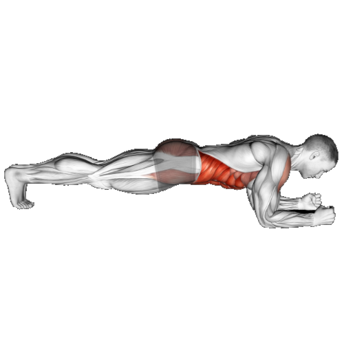

# Core and cardio

| # | Exercise                                                                             | Sets |       Reps |                                               Rest | Intensity |
|---|--------------------------------------------------------------------------------------|:----:|-----------:|---------------------------------------------------:|----------:|
| 1 | [Plank](#plank)                                                                      |  4   |   1 minute |                                           90 - 120 |        10 |
| 2 | [Bicycle crunches](#bicycle-crunches)                                                |  4   |         20 |                                           90 - 120 |        10 |
| 3 | [Side twists](#side-twists)                                                          |  4   |    15 e.s. |                                           60 -  90 |         9 |
| 4 | [Leg raises](#leg-raises)                                                            |  4   |         15 |                                           60 -  90 |         8 |
| 5 | [Mountain climbers](#mountain-climbers)                                              |  4   | 30 seconds |                                           60 -  90 |         9 |
| 6 | 6 Minute [E.M.O.M.](#emom---every-minute-on-the-minute "Every Minute On the Minute") |  4   |  6 minutes | As much as needed   but as minimal as possible |        10 |
|   | - [Squats](#squats)                                                                  |      |         10 |                                                    |           |
|   | - [Push-ups](#push-ups)                                                              |      |         12 |                                                    |           |
|   | - [Weighted leg raise](#weighted-leg-raise)                                          |      |         12 |                                                    |           |
|   | - [Kettlebell Swings](#kettlebell-swings)                                            |      |         12 |                                                    |           |
|   | - [Toe taps](#toe-taps)                                                              |      |         30 |                                                    |           |                                                  |           |

## Exercise notes

### Plank

Lie on your front with your forearms on the floor. Push up onto your toes and forearms, keeping your body in a straight line from head to heels.  
  
> <https://www.thegymgroup.com/exercises/abs-and-core-exercises/how-to-do-a-plank/>

### Bicycle crunches

Lie on your back with your hands behind your head. Lift your legs and bend your knees to 90 degrees. Bring your right elbow towards your left knee, then your left elbow towards your right knee.

> <https://strengthlevel.com/strength-standards/bicycle-crunch/>

### Side twists

Sit on the floor with your knees bent and your feet lifted. Lean back slightly and twist your torso to the right, then to the left.

> <https://www.hevyapp.com/exercises/side-twists/>

### Leg raises

Lie on your back with your legs straight. Lift your legs up until they’re vertical, then lower them back to the start.

> <https://www.hevyapp.com/exercises/leg-raises/>

### Mountain climbers

Start in a push-up position. Bring your right knee towards your chest, then quickly switch legs.

> <https://www.puregym.com/exercises/full-body/mountain-climbers/>

### E.M.O.M. - Every Minute On the Minute

Perform the following exercises every minute on the minute. Start a timer and do the exercises at the start of each minute. Rest for the remainder of the minute. Repeat for 6 minutes.

#### Squats

Stand with your feet shoulder-width apart. Push your hips back, bend your knees, and lower your body until your thighs are parallel to the floor. Push back up to the start.

> <https://www.thegymgroup.com/exercises/legs-exercises/how-to-do-a-squat/>

#### Push-ups

Start in a plank position with your hands under your shoulders. Lower your body until your chest almost touches the floor, then push back up.

> <https://www.thegymgroup.com/exercises/chest-exercises/how-to-do-a-push-up/>

#### Kettlebell Swings

Stand with your feet shoulder-width apart, holding a kettlebell with both hands. Bend your knees slightly, then push your hips back and swing the kettlebell between your legs. Stand up quickly and swing the kettlebell up to shoulder height.

> <https://www.thegymgroup.com/exercises/legs-exercises/how-to-do-a-kettlebell-swing/>

#### Toe taps

Set a bench or step in front of you. Stand with your feet shoulder-width apart and tap your right foot on the bench, then your left foot.

> <https://www.hevyapp.com/exercises/toe-taps/>

#### Weighted leg raise

Lie on your back with your legs straight and a weight between your feet. Lift your legs up until they’re vertical, then lower them back to the start.

> <https://www.hevyapp.com/exercises/leg-raises/>

---

## Muscles worked

| # | Exercise                                                                             | Muscles               |
|---|--------------------------------------------------------------------------------------|-----------------------|
| 1 | [Plank](#plank)                                                                      | Abdominals            |
| 2 | [Bicycle crunches](#bicycle-crunches)                                                |                       |
| 3 | [Side twists](#side-twists)                                                          | Obliques              |
| 4 | [Leg raises](#leg-raises)                                                            |                       |
| 5 | [Mountain climbers](#mountain-climbers)                                              |                       |
| 6 | 6 Minute [E.M.O.M.](#emom---every-minute-on-the-minute "Every Minute On the Minute") | Abdominals & Obliques |
|   | - [Squats](#squats)                                                                  |                       |
|   | - [Push-ups](#push-ups)                                                              |                       |
|   | - [Kettlebell Swings](#kettlebell-swings)                                            |                       |
|   | - [Toe taps](#toe-taps)                                                              |                       |
|   | - [Weighted leg raise](#weighted-leg-raise)                                          |                       |

---

[Effort Legend](../effort-legend.md)

---

## Acronyms

> E.M.O.M. = Every Minute On the Minute
