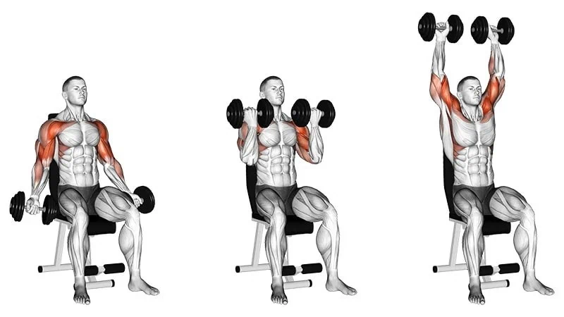
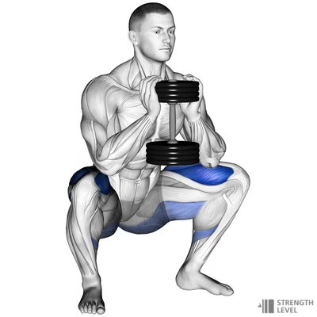
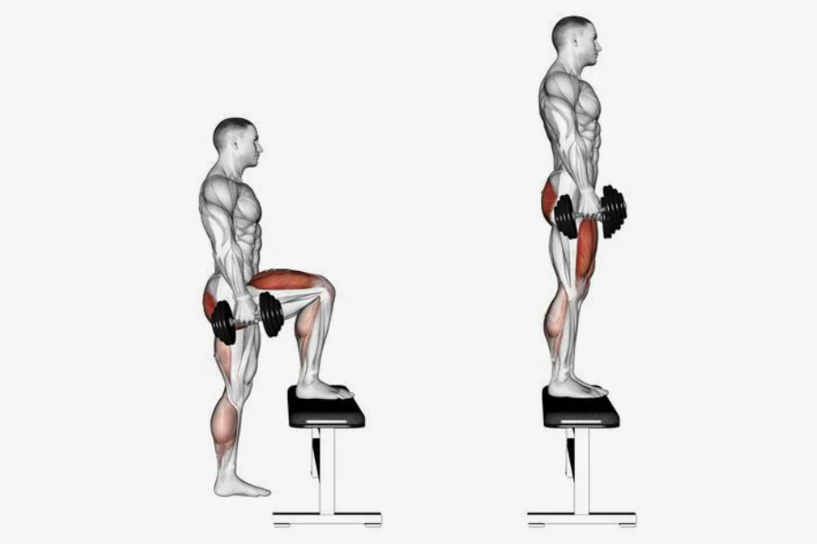
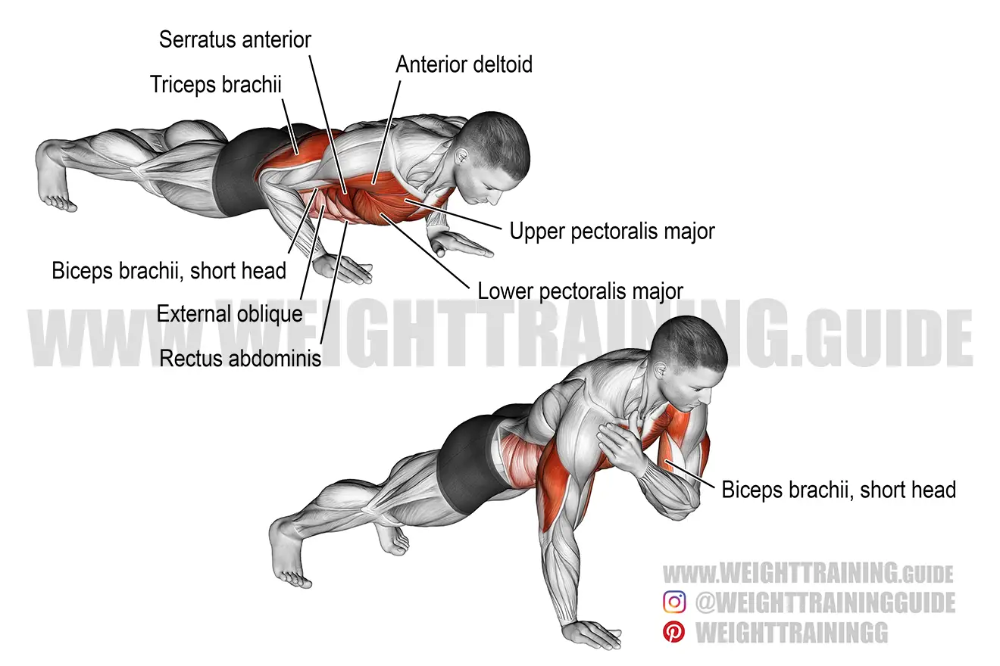
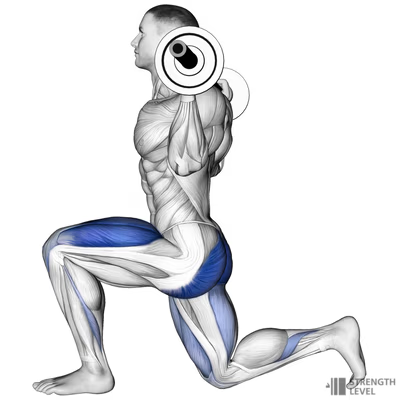
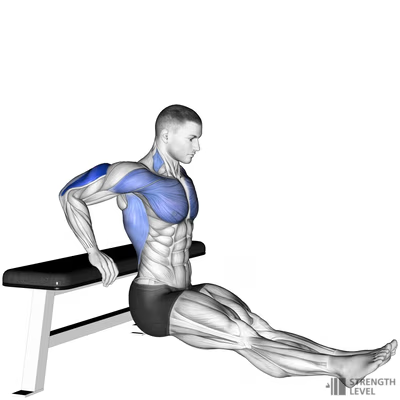

# Full body

| # | Exercise                                                    | Sets | [Reps](#week-reps) |     Rest | Intensity |
|---|-------------------------------------------------------------|:----:|-------------------:|---------:|----------:|
| 1 | [Bicep curl - shoulder press](#bicep-curl---shoulder-press) |  4   |               8-10 | 90 - 120 |        10 |
| 2 | [Goblet squat](#goblet-squat)                               |  4   |              10-12 | 90 - 120 |        10 |
| 3 | [Kettlebell Swings](#kettlebell-swings)                     |  3   |              10-15 | 60 -  90 |         9 |
| 4 | [Step-ups](#step-ups)                                       |  3   |              10-12 | 60 -  90 |         8 |
| 5 | [Plank tap](#plank-tap)                                     |  3   |                 12 | 60 -  90 |         9 |
| 6 | [Walking lunges](#walking-lunges)                           |  3   |                 10 | 60 -  90 |        10 |
| 7 | [Triceps Dips](#triceps-dips)                               |  3   |                 10 | 60 -  90 |        10 |

## Exercise Notes

### Bicep Curl - Shoulder Press

Stand with a dumbbell in each hand, arms by your sides, palms facing forward. Curl the weights up to shoulder height, then press them overhead until your arms are fully extended. Lower them back down in a controlled motion.  
  
> <https://workoutlabs.com/exercise-guide/dumbbell-biceps-curl-to-shoulder-press/>  

### Goblet Squat

Hold a kettlebell or dumbbell close to your chest with both hands. Stand with your feet shoulder-width apart. Lower your body into a squat, keeping your back straight and chest up. Push through your heels to return to the starting position.  
  
> <https://strengthlevel.com/strength-standards/goblet-squat>  

#### Kettlebell Swings

Stand with your feet shoulder-width apart, holding a kettlebell with both hands. Bend your knees slightly, then push your hips back and swing the kettlebell between your legs. Stand up quickly and swing the kettlebell up to shoulder height.

> <https://www.thegymgroup.com/exercises/legs-exercises/how-to-do-a-kettlebell-swing/>

### Step-ups

Stand in front of a bench or step. Place one foot on the surface and push through your heel to lift yourself up until both feet are on the step. Step back down and repeat with the other leg.  
  
> <https://strengthlevel.com/strength-standards/step-up/kg>  

### Plank Tap

Start in a high plank position with your hands directly under your shoulders. Tap one hand to the opposite shoulder while keeping your core engaged and hips stable. Alternate sides.  
  
> <https://weighttraining.guide/exercises/shoulder-tap-push-up/>  

### Walking Lunges

Stand tall with a dumbbell in each hand. Step forward with one leg and lower your hips until both knees are at 90-degree angles. Push off your front foot to bring your back leg forward into the next lunge. Repeat.  
  
> <https://strengthlevel.com/strength-standards/walking-lunge>  

### Triceps Dips

Sit on the edge of a bench or chair with your hands next to your hips. Slide your hips off the edge and lower your body by bending your elbows to about 90 degrees. Push through your hands to return to the start.  
  
> <https://strengthlevel.com/strength-standards/bench-dips>  

## Week Reps

| # | Exercise                                                    |      Week 1 |      Week 2 |      Week 3 |      Week 4 |
|---|-------------------------------------------------------------|------------:|------------:|------------:|------------:|
| 1 | [Bicep curl - shoulder press](#bicep-curl---shoulder-press) | 10,10,10,10 | 10,10, 8, 8 |  8, 8,10,10 | 10,10,10,10 |
| 2 | [Goblet squat](#goblet-squat)                               | 12,12,12,12 | 12,12,10,10 | 10,10,10,10 | 10,10,10,10 |
| 3 | [Kettlebell Swings](#kettlebell-swings)                     |    15,15,15 | 15,15,12,12 | 12,12,12,12 | 12,12,10,10 |
| 4 | [Step-ups](#step-ups)                                       |    12,12,12 |    12,12,12 |    10,10,10 |    10,10,10 |
| 5 | [Plank tap](#plank-tap)                                     |    12,12,12 |    12,12,12 |    12,12,12 |    12,12,12 |
| 6 | [Walking lunges](#walking-lunges)                           |          10 |          10 |          10 |          10 |
| 7 | [Triceps Dips](#triceps-dips)                               |          10 |          10 |          10 |          10 |

## Muscles worked

| # | Exercise                                                    | Muscles                           |
|---|-------------------------------------------------------------|-----------------------------------|
| 1 | [Bicep curl - shoulder press](#bicep-curl---shoulder-press) | Biceps, Deltoids, Upper Pec       |
| 2 | [Goblet squat](#goblet-squat)                               | Quads, Glutes, Calves             |
| 3 | [Kettlebell Swings](#kettlebell-swings)                     | Upper body & Lower body           |
| 4 | [Step-ups](#step-ups)                                       | Quads, Glutes, Calves, Hamstrings |
| 5 | [Plank tap](#plank-tap)                                     | Abdominals                        |
| 6 | [Walking lunges](#walking-lunges)                           | Quads, Glutes, Calves, Hamstrings |
| 7 | [Triceps Dips](#triceps-dips)                               | Triceps, pecs                     |

---

[Effort Legend](../effort-legend.md)

---
