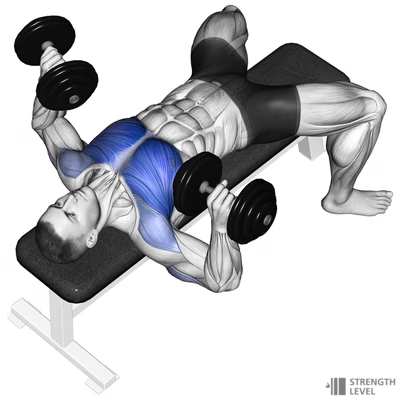
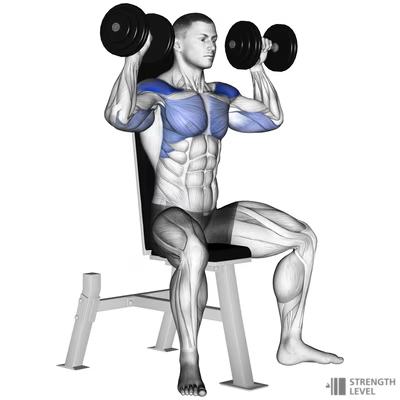
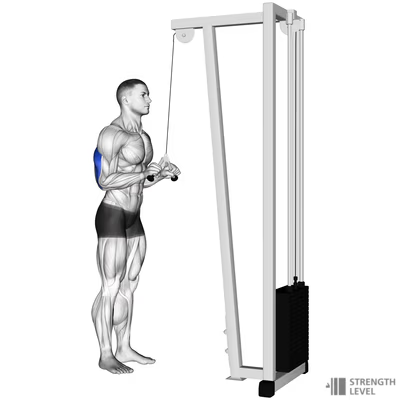

# Upper body

| # | Exercise                                  | Sets | [Reps](#week-reps) |     Rest | Intensity |
|---|-------------------------------------------|:----:|-------------------:|---------:|----------:|
| 1 | [Db press](#db-press)                     |  4   |               8-12 | 90 - 120 |        10 |
| 2 | [Overhead press](#overhead-press)         |  3   |               8-12 | 90 - 120 |        10 |
| 3 | [Side lateral](#side-lateral)             |  3   |              10-12 | 60 -  90 |         9 |
| 4 | [Lat pulldown](#lat-pulldown)             |  4   |               6-10 | 60 -  90 |         8 |
| 5 | [Barbell row](#barbell-row)               |  4   |               8-12 | 60 -  90 |         9 |
| 6 | [Bicep curls](#bicep-curls)               |  3   |              10-15 | 60 -  90 |        10 |
| 7 | [Triceps Push-downs](#triceps-push-downs) |  3   |              10-15 | 60 -  90 |        10 |

## Exercise notes

### DB Press

Lie on a flat bench with a dumbbell in each hand. Hold the weights at shoulder height, then press them up over your chest. Lower them back to the start.  
  
> <https://strengthlevel.com/strength-standards/dumbbell-bench-press/kg>  

### Overhead press

Stand with your feet shoulder-width apart. Hold a barbell at shoulder height with your hands just wider than shoulder-width apart. Press the barbell up over your head until your arms are fully extended. Lower it back to the start.  
  
> <https://strengthlevel.com/strength-standards/seated-dumbbell-shoulder-press/lb>  

### Side lateral

Stand with a dumbbell in each hand, arms by your sides, palms facing in. Raise your arms out to the sides until they’re at shoulder height. Lower them back to the start.  
  
> <https://strengthlevel.com/strength-standards/dumbbell-lateral-raise/kg>  

### Lat pulldown

Sit at a lat pulldown station and grab the bar with an overhand grip that’s just beyond shoulder-width. Pull the bar down to your chest, then slowly let it back up.  
  
> <https://strengthlevel.com/strength-standards/lat-pulldown/kg>  

### Barbell row

Stand with your feet shoulder-width apart, holding a barbell with an overhand grip. Bend at the hips and knees and lower your torso until it’s almost parallel to the floor. Pull the bar up to your lower chest, then lower it back to the start.  
  
> <https://strengthlevel.com/strength-standards/barbell-row/kg>  

### Bicep curls

Stand with a dumbbell in each hand, arms by your sides, palms facing forward. Curl the weights up to shoulder height, then lower them back to the start.  
  
> <https://strengthlevel.com/strength-standards/dumbbell-curl/kg>  

### Triceps Push-downs

Stand at a cable station and grab the bar with an overhand grip. Pull the bar down until your arms are fully extended, then slowly let it back up.  
  
> <https://strengthlevel.com/strength-standards/tricep-pushdown/kg>  

## Week Reps

| # | Exercise                                  |      Week 1 |      Week 2 |      Week 3 |      Week 4 |
|---|-------------------------------------------|------------:|------------:|------------:|------------:|
| 1 | [Db press](#db-press)                     | 12,12,12,12 | 12,12, 8, 8 |  8, 8, 8, 8 |   8,8,12,12 |
| 2 | [Overhead press](#overhead-press)         | 12,12,12,12 | 12,12, 8, 8 |  8, 8, 8, 8 |   8,8,12,12 |
| 3 | [Side lateral](#side-lateral)             |    12,12,12 |    12,12,10 |    12,10,10 |    10,10,10 |
| 4 | [Lat pulldown](#lat-pulldown)             | 10,10,10,10 | 10,10, 8, 8 |  8, 8, 8, 8 |  8, 8, 6, 6 |
| 5 | [Barbell row](#barbell-row)               | 12,12,12,12 | 12,12,10,10 | 10,10,10,10 | 10,10, 8, 8 |
| 6 | [Bicep curls](#bicep-curls)               |    15,12,10 |    15,12,10 |    15,12,10 |    15,12,10 |
| 7 | [Triceps Push-downs](#triceps-push-downs) |    15,12,10 |    15,12,10 |    15,12,10 |    15,12,10 |

## Muscles worked

| # | Exercise                                  | Muscles                   |
|---|-------------------------------------------|---------------------------|
| 1 | [Db press](#db-press)                     | pecs, delts, triceps      |
| 2 | [Overhead press](#overhead-press)         | Delts, upper pec, triceps |
| 3 | [Side lateral](#side-lateral)             | Delts                     |
| 4 | [Lat pulldown](#lat-pulldown)             | Lats, biceps, traps       |
| 5 | [Barbell row](#barbell-row)               | Upper back, lats, biceps  |
| 6 | [Bicep curls](#bicep-curls)               | Biceps, forearms          |
| 7 | [Triceps Push-downs](#triceps-push-downs) | triceps                   |

---

[Effort Legend](../effort-legend.md)

---
