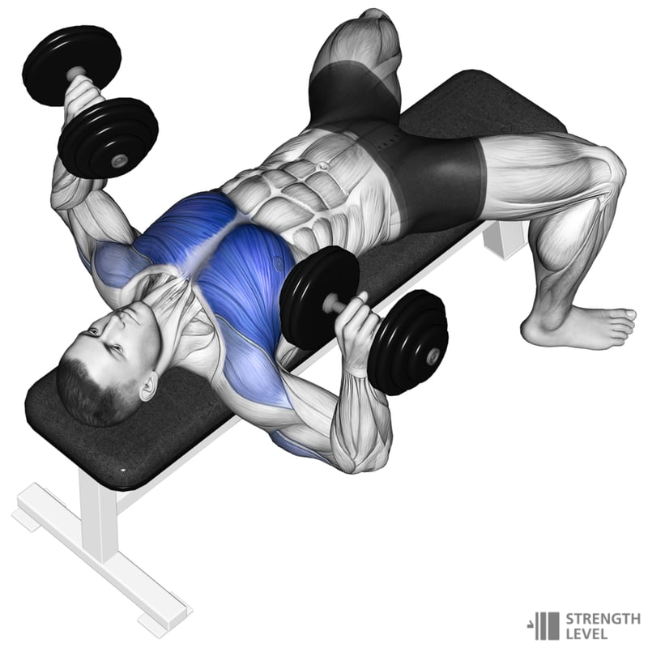

# [Fitness Training](https://realmarkcrowe.github.io/fitness-training/ "Fitness Training")

## Training Plan

By Neil McLoughlin

**4 Week - 5 Days - Strength & Hypertrophy focused.**  

Aim: Build strength, increase muscle mass, and burn fat mass.

### DAY 1 – Upper body

| Exercise           | Muscles                   | Sets | Reps  | Rest   | Intensity | Week 1      | Week 2      | Week 3      | Week 4     |
|--------------------|---------------------------|------|-------|--------|-----------|-------------|-------------|-------------|------------|
| Db press           | pecs, delts, triceps      | 4    | 8-12  | 90-120 | 10        | 12,12,12,12 | 12,12,8,8   | 8,8,8,8     | 8,8,12,12, |
| Overhead press     | Delts, upper pec, triceps | 3    | 8-12  | 90-120 | 10        | 12,12,12,12 | 12,12,8,8   | 8,8,8,8     | 8,8,12,12, |
| Side lateral       | Delts                     | 3    | 10-12 | 60-90  | 9         | 12,12,12    | 12,12,10    | 12,10,10    | 10,10,10   |
| Lat pulldown       | Lats, biceps, traps       | 4    | 6-10  | 60-90  | 8         | 10,10,10,10 | 10,10,8,8   | 8,8,8,8     | 8,8,6,6,   |
| Barbell row        | Upper back, lats, biceps  | 4    | 8-12  | 60-90  | 9         | 12,12,12,12 | 12,12,10,10 | 10,10,10,10 | 10,10,8,8  |
| Bicep curls        | Biceps, forearms          | 3    | 10-15 | 60-90  | 10        | 15,12,10    | 15,12,10    | 15,12,10    | 15,12,10   |
| Triceps Push-downs | triceps                   | 3    | 10-15 | 60-90  | 10        | 15,12,10    | 15,12,10    | 15,12,10    | 15,12,10   |

#### Exercise notes

- **Db press**: Lie on a flat bench with a dumbbell in each hand. Hold the weights at shoulder height, then press them up over your chest. Lower them back to the start.

### DAY 2 – Lower body

| Exercise      | Muscles                         | Sets | Reps | Rest   | Intensity | Week 1      | Week 2      | Week 3     | Week 4    |
|---------------|---------------------------------|------|------|--------|-----------|-------------|-------------|------------|-----------|
| Back squat    | Quads, glutes calves            | 4    | 6-10 | 90-120 | 10        | 10,10,10,10 | 10,10,8,8,  | 8,8,8,8,   | 8,8,6,6,  |
| RDL           | Hamstrings, back, glutes calves | 4    | 8-10 | 90-120 | 10        | 10,10,10,10 | 10,10,10,8, | 10,10,8,8, | 10,8,8,8, |
| Forward lunge | Quads, glutes, calves           | 3    | 10   | 60-90  | 9         | 10          | 10          | 10         | 10        |
| Leg raise     | Quads                           | 3    | 10   | 60-90  | 8         | 10          | 10          | 10         | 10        |
| Plank         | Abdominals                      | 3    | 60   | 60-90  | 9         | 60          | 60          | 60         | 60        |
| Russian twist | Abdominals                      | 3    | 30   | 60-90  | 10        | 30          | 30          | 30         | 30        |
| Dead bugs     | Abdominals                      | 3    | 20   | 60-90  | 10        | 20          | 20          | 20         | 20        |

### DAY 3 – Core & cardio

| Exercise                                                                                 | Muscles               | Sets | Reps  | Rest                                                    | Intensity | Week 1 | Week 2 | Week 3 | Week 4 |
|------------------------------------------------------------------------------------------|-----------------------|------|-------|---------------------------------------------------------|-----------|--------|--------|--------|--------|
| Plank                                                                                    | Abdominals            | 4    | 1min  | 90-120                                                  | 10        | 1      | 1      | 1      | 1      |
| Bicycle crunches                                                                         |                       | 4    | 20    | 90-120                                                  | 10        | 20     | 20     | 20     | 20     |
| Side twists                                                                              | Obliques              | 4    | 15 es | 60-90                                                   | 9         | 15es   | 15es   | 15es   | 15es   |
| Leg raises                                                                               |                       | 4    | 15    | 60-90                                                   | 8         | 15     | 15     | 15     | 15     |
| Mountain climbers                                                                        |                       | 4    | 30sec | 60-90                                                   | 9         | 30     | 30     | 30     | 30     |
| 6 min Emom  - Squats 10/push-ups 12/balls slams 12/toe taps 30/weighted leg raise 12 | Abdominals & Obliques | 4    |       | 
As much as needed but as minimal as possible
 | 10        |        |        |        |        |

### DAY 4 – Full body

| Exercise                    | Muscles                               | Sets | Reps  | Rest   | Intensity | Week 1      | Week 2      | Week 3      | Week 4      |
|-----------------------------|---------------------------------------|------|-------|--------|-----------|-------------|-------------|-------------|-------------|
| Bicep curl - shoulder press | Biceps, deltoids, upper pec       | 4    | 8-10  | 90-120 | 10        | 10,10,10,10 | 10,10,8,8   | 8,8,10,10   | 10,10,10,10 |
| Goblet squat                | Quads, glutes, calves                 | 4    | 10-12 | 90-120 | 10        | 12,12,12,12 | 12,12,10,10 | 10,10,10,10 | 10,10,10,10 |
| KB swing                    | Upper body & lower body               | 3    | 10-15 | 60-90  | 9         | 15,15,15    | 15,15,12,12 | 12,12,12,12 | 12,12,10,10 |
| Step-ups                    | Quads, glutes, calves, hamstrings | 3    | 10-12 | 60-90  | 8         | 12,12,12    | 12,12,12    | 10,10,10    | 10,10,10    |
| Plank tap                   | Abdominals                            | 3    | 12    | 60-90  | 9         | 12,12,12    | 12,12,12    | 12,12,12    | 12,12,12    |
| Walking lunges              | Quads, glutes, calves, hamstrings | 3    | 10    | 60-90  | 10        | 10          | 10          | 10          | 10          |
| Triceps Dips                | Triceps, pecs                         | 3    | 10    | 60-90  | 10        | 10          | 10          | 10          | 10          |

### DAY 5 – Active recovery/light cardio/swimming/stretching

| Exercise           | Sets | Reps     | Rest | Intensity | Week 1-4 |
|--------------------|------|----------|------|-----------|----------|
| swim/treadmill/mix |      | 20-90min |      | moderate  |          |
| All stretches      | 4    | 30sec    |      |           |          |

### Legend

| Rating of perceived  effort (RPE) | Intensity of effort         |
|---------------------------------------|-----------------------------|
| 0                                     | Nothing at all              |
| 1                                     | Very weak                   |
| 2                                     | Weak                        |
| 3                                     | Moderate                    |
| 4                                     | Somewhat hard               |
| 5                                     | Hard                        |
| 6                                     | Moderately hard             |
| 7                                     | Very hard                   |
| 8                                     | Very, very hard             |
| 9                                     | Near maximal                |
| 10                                    | Extremely strong or maximal |

---
