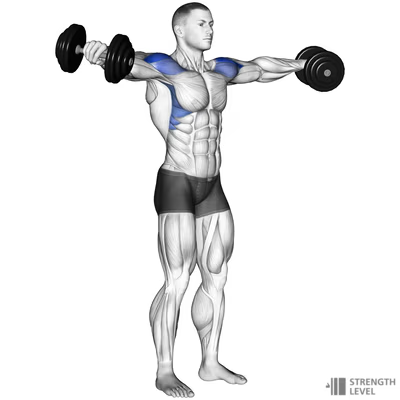
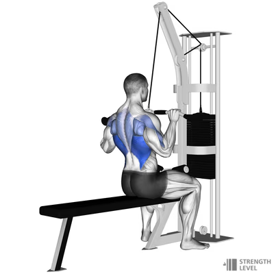
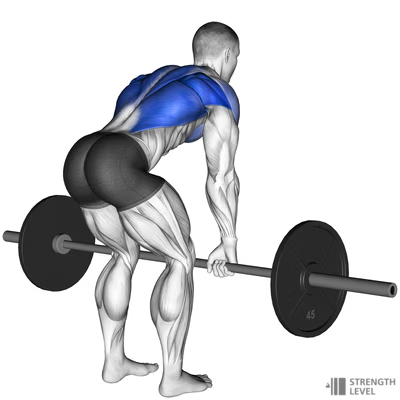
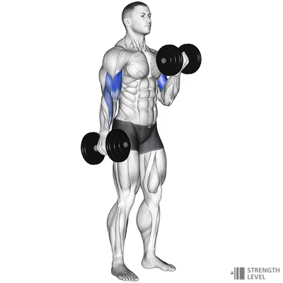
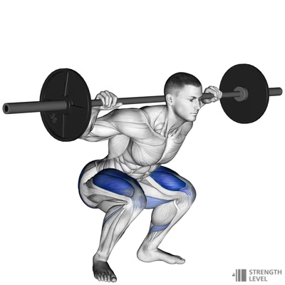
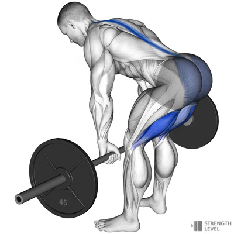
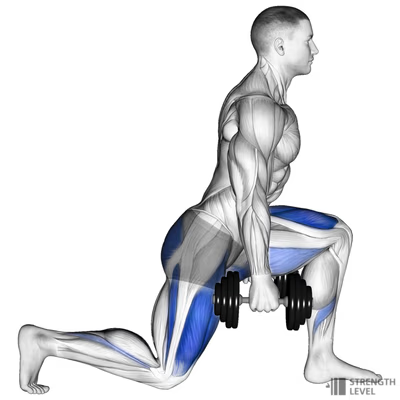
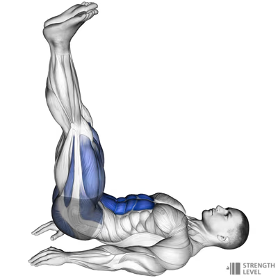
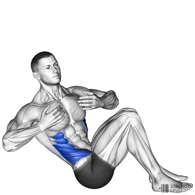
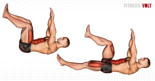

# Training Plan

By Neil McLoughlin

**4 Week - 5 Days - Strength & Hypertrophy focused.**  

Aim: Build strength, increase muscle mass, and burn fat mass.

## DAY 1 – Upper body

| # | Exercise           | Muscles                   | Sets | Reps  | Rest   | Intensity | Week 1      | Week 2      | Week 3      | Week 4     |
|---|--------------------|---------------------------|------|-------|--------|-----------|-------------|-------------|-------------|------------|
| 1 | Db press           | pecs, delts, triceps      | 4    | 8-12  | 90-120 | 10        | 12,12,12,12 | 12,12,8,8   | 8,8,8,8     | 8,8,12,12, |
| 2 | Overhead press     | Delts, upper pec, triceps | 3    | 8-12  | 90-120 | 10        | 12,12,12,12 | 12,12,8,8   | 8,8,8,8     | 8,8,12,12, |
| 3 | Side lateral       | Delts                     | 3    | 10-12 | 60-90  | 9         | 12,12,12    | 12,12,10    | 12,10,10    | 10,10,10   |
| 4 | Lat pulldown       | Lats, biceps, traps       | 4    | 6-10  | 60-90  | 8         | 10,10,10,10 | 10,10,8,8   | 8,8,8,8     | 8,8,6,6,   |
| 5 | Barbell row        | Upper back, lats, biceps  | 4    | 8-12  | 60-90  | 9         | 12,12,12,12 | 12,12,10,10 | 10,10,10,10 | 10,10,8,8  |
| 6 | Bicep curls        | Biceps, forearms          | 3    | 10-15 | 60-90  | 10        | 15,12,10    | 15,12,10    | 15,12,10    | 15,12,10   |
| 7 | Triceps Push-downs | triceps                   | 3    | 10-15 | 60-90  | 10        | 15,12,10    | 15,12,10    | 15,12,10    | 15,12,10   |

### DAY 1 - Exercise notes

1. **Db press**: Lie on a flat bench with a dumbbell in each hand. Hold the weights at shoulder height, then press them up over your chest. Lower them back to the start.  
     
   > <https://strengthlevel.com/strength-standards/dumbbell-bench-press/kg>  
2. **Overhead-press**: Stand with your feet shoulder-width apart. Hold a barbell at shoulder height with your hands just wider than shoulder-width apart. Press the barbell up over your head until your arms are fully extended. Lower it back to the start.  
     
   > <https://strengthlevel.com/strength-standards/seated-dumbbell-shoulder-press/lb>  
3. **Side lateral**: Stand with a dumbbell in each hand, arms by your sides, palms facing in. Raise your arms out to the sides until they’re at shoulder height. Lower them back to the start.  
     
   > <https://strengthlevel.com/strength-standards/dumbbell-lateral-raise/kg>  
4. **Lat pulldown**: Sit at a lat pulldown station and grab the bar with an overhand grip that’s just beyond shoulder-width. Pull the bar down to your chest, then slowly let it back up.  
     
   > <https://strengthlevel.com/strength-standards/lat-pulldown/kg>  
5. **Barbell row**: Stand with your feet shoulder-width apart, holding a barbell with an overhand grip. Bend at the hips and knees and lower your torso until it’s almost parallel to the floor. Pull the bar up to your lower chest, then lower it back to the start.  
     
   > <https://strengthlevel.com/strength-standards/barbell-row/kg>  
6. **Bicep curls**: Stand with a dumbbell in each hand, arms by your sides, palms facing forward. Curl the weights up to shoulder height, then lower them back to the start.  
     
   > <https://strengthlevel.com/strength-standards/dumbbell-curl/kg>  
7. **Triceps Push-downs**: Stand at a cable station and grab the bar with an overhand grip. Pull the bar down until your arms are fully extended, then slowly let it back up.  
     
   > <https://strengthlevel.com/strength-standards/tricep-pushdown/kg>  

## DAY 2 – Lower body

| # | Exercise      | Muscles                         | Sets | Reps | Rest   | Intensity | Week 1      | Week 2      | Week 3     | Week 4    |
|---|---------------|---------------------------------|------|------|--------|-----------|-------------|-------------|------------|-----------|
| 1 | Back squat    | Quads, glutes calves            | 4    | 6-10 | 90-120 | 10        | 10,10,10,10 | 10,10,8,8,  | 8,8,8,8,   | 8,8,6,6,  |
| 2 | RDL           | Hamstrings, back, glutes calves | 4    | 8-10 | 90-120 | 10        | 10,10,10,10 | 10,10,10,8, | 10,10,8,8, | 10,8,8,8, |
| 3 | Forward lunge | Quads, glutes, calves           | 3    | 10   | 60-90  | 9         | 10          | 10          | 10         | 10        |
| 4 | Leg raise     | Quads                           | 3    | 10   | 60-90  | 8         | 10          | 10          | 10         | 10        |
| 5 | Plank         | Abdominals                      | 3    | 60   | 60-90  | 9         | 60          | 60          | 60         | 60        |
| 6 | Russian twist | Abdominals                      | 3    | 30   | 60-90  | 10        | 30          | 30          | 30         | 30        |
| 7 | Dead bugs     | Abdominals                      | 3    | 20   | 60-90  | 10        | 20          | 20          | 20         | 20        |

### Day 2 - Exercise notes

1. **Back squat**: Stand with your feet shoulder-width apart, holding a barbell across your upper back. Bend at the hips and knees and lower your body until your thighs are parallel to the floor. Push back up to the start.  
     
   > <https://strengthlevel.com/strength-standards/squat/kg>
2. **RDL**: Stand with your feet hip-width apart, holding a barbell in front of your thighs. Bend at the hips and lower the barbell down your legs until you feel a stretch in your hamstrings. Stand back up to the start.  
     
   > <https://strengthlevel.com/strength-standards/romanian-deadlift/kg>
3. **Forward lunge**: Stand with your feet hip-width apart, holding a dumbbell in each hand. Step forward with one leg and lower your body until your front thigh is parallel to the floor. Push back up to the start.  
     
   > <https://strengthlevel.com/strength-standards/dumbbell-lunge/kg>
4. **Leg raise**: Lie on your back with your legs straight. Lift your legs up until they’re perpendicular to the floor, then lower them back to the start.  
     
   > <https://strengthlevel.com/strength-standards/leg-raise/kg>
5. **Plank**: Lie on your front with your forearms on the floor. Push up onto your toes and forearms, keeping your body in a straight line from head to heels.  
     
   > <https://www.endomondo.com/exercise/high-plank>
6. **Russian twist**: Sit on the floor with your knees bent and feet off the floor. Hold a weight in front of your chest and twist your torso to one side, then the other.  
     
   > <https://strengthlevel.com/strength-standards/russian-twist/kg>
7. **Dead bugs**: Lie on your back with your arms extended towards the ceiling and your legs in the air. Lower one arm and the opposite leg towards the floor, then return to the start.  
     
   > <https://fitnessvolt.com/dead-bug-exercise/>

## DAY 3 – Core & cardio

| Exercise                                                                                     | Muscles               | Sets | Reps  | Rest                                                    | Intensity | Week 1 | Week 2 | Week 3 | Week 4 |
|----------------------------------------------------------------------------------------------|-----------------------|------|-------|---------------------------------------------------------|-----------|--------|--------|--------|--------|
| Plank                                                                                        | Abdominals            | 4    | 1min  | 90-120                                                  | 10        | 1      | 1      | 1      | 1      |
| Bicycle crunches                                                                             |                       | 4    | 20    | 90-120                                                  | 10        | 20     | 20     | 20     | 20     |
| Side twists                                                                                  | Obliques              | 4    | 15 es | 60-90                                                   | 9         | 15es   | 15es   | 15es   | 15es   |
| Leg raises                                                                                   |                       | 4    | 15    | 60-90                                                   | 8         | 15     | 15     | 15     | 15     |
| Mountain climbers                                                                            |                       | 4    | 30sec | 60-90                                                   | 9         | 30     | 30     | 30     | 30     |
| 6 min E.M.O.M.  - Squats 10/push-ups 12/balls slams 12/toe taps 30/weighted leg raise 12 | Abdominals & Obliques | 4    |       | 
As much as needed but as minimal as possible
 | 10        |        |        |        |        |

## DAY 4 – Full body

| Exercise                    | Muscles                               | Sets | Reps  | Rest   | Intensity | Week 1      | Week 2      | Week 3      | Week 4      |
|-----------------------------|---------------------------------------|------|-------|--------|-----------|-------------|-------------|-------------|-------------|
| Bicep curl - shoulder press | Biceps, deltoids, upper pec       | 4    | 8-10  | 90-120 | 10        | 10,10,10,10 | 10,10,8,8   | 8,8,10,10   | 10,10,10,10 |
| Goblet squat                | Quads, glutes, calves                 | 4    | 10-12 | 90-120 | 10        | 12,12,12,12 | 12,12,10,10 | 10,10,10,10 | 10,10,10,10 |
| KB swing                    | Upper body & lower body               | 3    | 10-15 | 60-90  | 9         | 15,15,15    | 15,15,12,12 | 12,12,12,12 | 12,12,10,10 |
| Step-ups                    | Quads, glutes, calves, hamstrings | 3    | 10-12 | 60-90  | 8         | 12,12,12    | 12,12,12    | 10,10,10    | 10,10,10    |
| Plank tap                   | Abdominals                            | 3    | 12    | 60-90  | 9         | 12,12,12    | 12,12,12    | 12,12,12    | 12,12,12    |
| Walking lunges              | Quads, glutes, calves, hamstrings | 3    | 10    | 60-90  | 10        | 10          | 10          | 10          | 10          |
| Triceps Dips                | Triceps, pecs                         | 3    | 10    | 60-90  | 10        | 10          | 10          | 10          | 10          |

## DAY 5 – Active recovery/light cardio/swimming/stretching

| Exercise           | Sets | Reps     | Rest | Intensity | Week 1-4 |
|--------------------|------|----------|------|-----------|----------|
| swim/treadmill/mix |      | 20-90min |      | moderate  |          |
| All stretches      | 4    | 30sec    |      |           |          |

## Legend

| Rating of perceived  effort (RPE) | Intensity of effort         |
|---------------------------------------|-----------------------------|
| 0                                     | Nothing at all              |
| 1                                     | Very weak                   |
| 2                                     | Weak                        |
| 3                                     | Moderate                    |
| 4                                     | Somewhat hard               |
| 5                                     | Hard                        |
| 6                                     | Moderately hard             |
| 7                                     | Very hard                   |
| 8                                     | Very, very hard             |
| 9                                     | Near maximal                |
| 10                                    | Extremely strong or maximal |

---

> E.M.O.M. = Every Minute On the Minute
